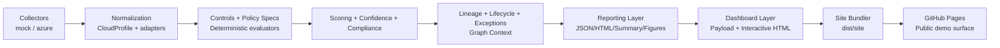
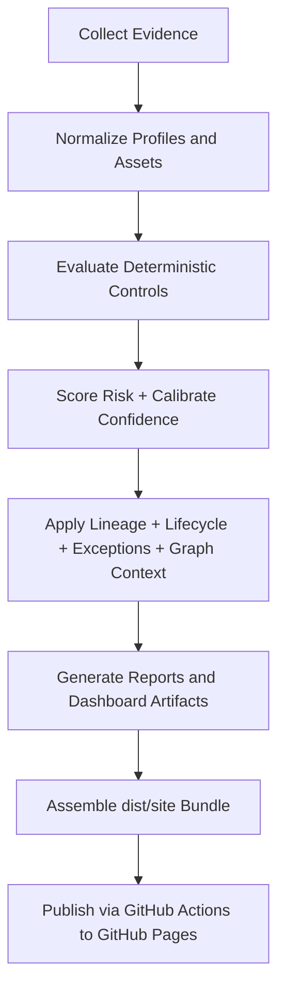
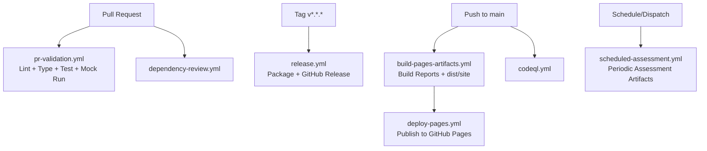

# CRIS-SME

**Evidence-Driven Cloud Risk Decision Engine for SMEs**

CRIS-SME is a deterministic, explainable cloud governance risk platform built for small and medium enterprises.
It turns cloud posture evidence into traceable control decisions, prioritized findings, lifecycle-aware governance actions, and stakeholder-ready outputs.

The platform is intentionally **Azure-first in active live collection**, **provider-neutral in core modeling**, and **home-lab runnable by default**.

---

## Why CRIS-SME

Many SME cloud teams are stuck between:

- enterprise-grade platforms that are expensive and operationally heavy
- basic scanners that produce findings without enough decision context

CRIS-SME is designed to bridge that gap with deterministic scoring, explicit evidence boundaries, and practical remediation planning.

---

## Key Capabilities

- Evidence collection via `mock` and `azure` collectors
- Provider-normalized posture modeling and adapter strategy
- Deterministic control evaluation across 6 domains / 26 controls
- Confidence calibration with explicit rationale and metadata
- Finding lineage with stable finding IDs and trace objects
- Finding lifecycle tracking (`open`, `in_progress`, `accepted_risk`, `resolved`, `suppressed`, `expired_exception`)
- Exception registry support with expiry-aware governance
- Policy governance via control specs and versioned policy-pack metadata
- Lightweight graph-context prioritization:
  - blast radius estimation
  - toxic combination detection
  - exposure chain summaries
- Compliance/readiness mapping across multiple frameworks
- Historical drift analytics (new/resolved findings, regressions, score trends)
- Executive and technical outputs:
  - JSON/HTML reports
  - interactive dashboard HTML + payload
  - appendix, benchmark, action-plan, insurance, and executive exports
- GitHub Actions delivery with GitHub Pages publication

---

## Architecture



High-level architecture layers:

1. Evidence layer: collection, provenance, observability bounds
2. Asset/context layer: normalized assets + relationships
3. Decision layer: deterministic controls, scoring, lifecycle, compliance
4. Experience layer: reports, dashboard, artifact exports
5. Delivery layer: CI validation, release packaging, Pages publication

---

## High-Level Implementation Flow



---

## CI/CD and Pages Flow



---

## Repository Structure

```text
CRIS-SME/
├── .github/workflows/         # CI/CD, security, pages, release automation
├── data/                      # Control catalog, overrides, exception registry
├── docs/                      # Architecture, methodology, lifecycle, dashboard, CI/CD docs
├── scripts/                   # Repeatable run helpers + site bundler
├── src/cris_sme/
│   ├── collectors/            # Evidence collectors and provider adapters
│   ├── controls/              # Deterministic control evaluators
│   ├── engine/                # Scoring, lifecycle, lineage, graph context, compliance
│   ├── models/                # Typed schemas (cloud profile + platform entities)
│   ├── policies/              # Control governance metadata
│   ├── reporting/             # Report and dashboard builders/exporters
│   └── main.py                # End-to-end pipeline entrypoint
├── tests/                     # Unit and integration tests
└── requirements.txt           # Runtime + test dependencies
```

---

## Quickstart

### 1. Environment setup

```bash
git clone https://github.com/m-khan-97/CRIS-SME.git
cd CRIS-SME
python3 -m venv .venv
source .venv/bin/activate
pip install -r requirements.txt
```

### 2. Run mock assessment (default)

```bash
PYTHONPATH=src python3 -m cris_sme.main
```

### 3. Run Azure assessment (when authenticated)

```bash
export CRIS_SME_COLLECTOR=azure
export AZURE_SUBSCRIPTION_ID=<your-subscription-id>   # optional scoping
PYTHONPATH=src python3 -m cris_sme.main
```

### 4. Run tests

```bash
PYTHONPATH=src pytest -q
```

---

## Running the Local Pipeline End-to-End

1. Generate assessment outputs:

```bash
PYTHONPATH=src python3 scripts/run_assessment_snapshot.py --collector mock
```

2. Build a Pages-ready static bundle:

```bash
python3 scripts/build_pages_site.py --reports-dir outputs/reports --figures-dir outputs/figures --dist-dir dist
```

3. Preview locally:

```bash
python3 -m http.server 8080 --directory dist/site
```

Then open:

- `http://127.0.0.1:8080/` (landing page)
- `http://127.0.0.1:8080/dashboard.html`
- `http://127.0.0.1:8080/report.html`

---

## Dashboard and Output Experience

Primary generated outputs:

- `outputs/reports/cris_sme_report.json`
- `outputs/reports/cris_sme_report.html`
- `outputs/reports/cris_sme_dashboard_payload.json`
- `outputs/reports/cris_sme_dashboard.html`
- `outputs/reports/cris_sme_summary.txt`

Pages bundle outputs:

- `dist/site/index.html`
- `dist/site/dashboard.html`
- `dist/site/report.html`
- `dist/site/data/*.json`
- `dist/site/assets/figures/*`
- `dist/manifests/build-metadata.json`

---

## GitHub Actions and GitHub Pages

Implemented workflows:

- `pr-validation.yml`: pull request quality gate
- `build-pages-artifacts.yml`: build report/dashboard/site bundle on `main`
- `deploy-pages.yml`: reusable GitHub Pages deploy workflow
- `release.yml`: tag-driven release packaging and GitHub Release publication
- `scheduled-assessment.yml`: periodic or manual assessment generation with safe fallback behavior
- `codeql.yml`: CodeQL security analysis
- `dependency-review.yml`: dependency risk review for PRs
- `reusable-python-quality.yml`: reusable lint/type/test pipeline

To enable publishing:

1. In repository settings, open **Pages**.
2. Set source to **GitHub Actions**.
3. Push to `main` (or manually dispatch `build-pages-artifacts.yml`).

---

## Output Artifact Map

| Artifact | Path | Purpose |
| --- | --- | --- |
| Technical JSON report | `outputs/reports/cris_sme_report.json` | Machine-readable decision output |
| Technical HTML report | `outputs/reports/cris_sme_report.html` | Human-readable technical report |
| Dashboard payload | `outputs/reports/cris_sme_dashboard_payload.json` | Structured dashboard data |
| Dashboard HTML | `outputs/reports/cris_sme_dashboard.html` | Interactive console view |
| History snapshots | `outputs/reports/history/*.json` | Drift and trend baselines |
| Figures | `outputs/figures/*` | Chart-ready visuals for reporting |
| Pages landing page | `dist/site/index.html` | Public demo entrypoint |
| Pages metadata manifest | `dist/manifests/build-metadata.json` | Build provenance and checksums |

---

## Current Scope and Honest Limitations

Active provider maturity:

- Azure: active (mock + live path)
- AWS: planned/partial (adapter scaffolding)
- GCP: planned/partial (adapter scaffolding)

Important boundaries:

- deterministic scoring is authoritative
- optional narrator is non-authoritative and does not alter score math
- graph-context logic is prioritization support, not full attack-path simulation
- some evidence domains remain intentionally conservative/partially observable depending on collector scope and permissions

---

## Engineering Principles

- Deterministic before probabilistic
- Evidence-backed before narrative-backed
- Explicit observability boundaries over false certainty
- Extensible architecture without fake enterprise complexity
- Outputs that serve engineers, executives, and auditors/researchers
- Home-lab first: local execution should stay practical

---

## Documentation Index

Core platform docs:

- [Project Overview](docs/project-overview.md)
- [Architecture](docs/architecture.md)
- [Methodology](docs/methodology.md)
- [Scoring Model](docs/scoring-model.md)
- [Compliance Mapping](docs/compliance-mapping.md)
- [Dashboard](docs/dashboard.md)

Data/decision model docs:

- [Data Model](docs/data-model.md)
- [Evidence Lineage](docs/evidence-lineage.md)
- [Control Lifecycle](docs/control-lifecycle.md)
- [Finding Lifecycle](docs/finding-lifecycle.md)
- [History and Drift](docs/history-and-drift.md)
- [Frontend Architecture](docs/frontend-architecture.md)
- [Provider Capability Matrix](docs/provider-capability-matrix.md)

Delivery docs:

- [CI/CD and GitHub Pages Delivery](docs/ci-cd-and-pages.md)
- [Multi-cloud Expansion Strategy](docs/multi-cloud-expansion.md)
- [Roadmap](docs/roadmap.md)

---

## Roadmap (Practical Next Steps)

1. Expand active provider support beyond Azure while keeping evidence parity standards.
2. Add richer exception workflows and governance audit trails.
3. Increase graph-context depth with asset-level evidence relationships.
4. Add API-mode serving for dashboard payloads while preserving static artifact mode.
5. Strengthen signed artifact provenance for audit-focused deployments.

---

## Maturity Statement

CRIS-SME is production-shaped in architecture and release engineering, with honest scope limits.
It is suitable for home-lab demos, portfolio presentation, engineering research artifacts, and SME-focused cloud governance experimentation.

---

## License

MIT License
