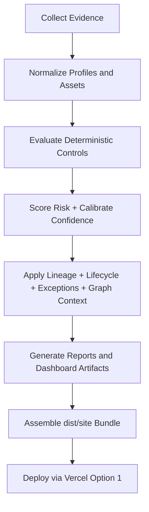
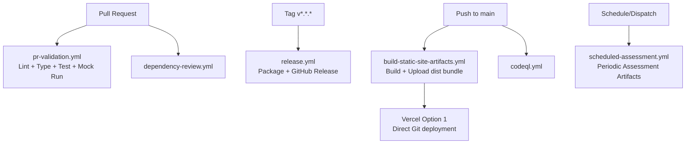

# CRIS-SME

**Evidence in. Decisions out.**

CRIS-SME is a deterministic cloud risk governance platform for small and medium enterprises.
It converts cloud posture evidence into traceable control decisions, prioritized findings, lifecycle-aware risk records, and stakeholder-ready assurance artifacts.

It is not a generic scanner. CRIS-SME is the decision layer between cloud evidence and accountable risk action: every finding is designed to be explainable, repeatable, and grounded in evidence quality.

The project is **Azure-first in active live collection**, **provider-neutral in core architecture**, **home-lab runnable by default**, and shaped for deeper R&D into evidence-based cloud risk governance.

---

## Why CRIS-SME

SME cloud teams are often forced between two poor options:

- enterprise platforms that are too expensive or operationally heavy
- lightweight scanners that create alerts without enough decision context

CRIS-SME focuses on deterministic, evidence-backed risk intelligence that remains practical to run, explain, approve, and report.

The product wedge is:

- cloud evidence collection without hiding observability limits
- deterministic control decisions rather than opaque scoring
- finding lineage, lifecycle, and exception governance
- SME-aware remediation plans that consider cost and operating capacity
- board, insurer, auditor, and technical outputs from the same evidence base

---

## Key Capabilities

- Evidence collection via `mock` and `azure` collectors
- Provider-normalized posture modeling and adapter strategy
- Deterministic control evaluation across 6 domains / 26 controls
- Confidence calibration with explicit rationale metadata
- Stable finding lineage (`finding_id`, trace, evidence refs, rule version)
- Finding lifecycle support (`open`, `in_progress`, `accepted_risk`, `resolved`, `suppressed`, `expired_exception`)
- Exception registry with expiry-aware handling
- Governed control metadata via policy-pack control specs
- Lightweight graph-context prioritization:
  - blast radius estimation
  - toxic combination detection
  - exposure chain summaries
- Compliance/readiness mapping across multiple frameworks
- Historical drift analysis (score trends, new/resolved findings, recurring regressions)
- Rich outputs for technical and executive audiences:
  - JSON + HTML reports
  - interactive dashboard HTML + payload
  - action plans, executive and insurance packs, appendix/benchmark exports
- GitHub Actions validation and release engineering
- Vercel-ready static hosting bundle in `dist/site/`

---

## Transformation Direction

CRIS-SME is evolving toward a state-of-the-art cloud risk decision methodology:

- **Decision Ledger**: append-only history of findings, exceptions, score movement, evidence references, and approvals
- **Risk Bill of Materials**: signed evidence/control/report manifest for assurance and customer trust
- **Assessment Replay**: saved normalized evidence snapshots that replay deterministic decisions without recollecting cloud data
- **Assessment Assurance**: separate trust score for report reproducibility, lineage, evidence quality, and integrity
- **Evidence Gap Backlog**: actionable queue for collector enrichment and provider activation gaps
- **Remediation Simulator**: deterministic "fix these controls, reduce this risk" planning
- **Insurance Evidence Gateway**: insurer-questionnaire answers backed by confidence and proof references
- **Provider Evidence Contracts**: explicit per-provider coverage, freshness, and evidence sufficiency rules
- **SaaS/API Plane**: assessment, finding, exception, report, and policy-pack APIs
- **AI Risk Narrator**: optional plain-language translation that never changes deterministic scores

See [transformation strategy](docs/product-strategy.md), [innovation and UKRI readiness](docs/innovation-and-ukri-readiness.md), [assessment replay](docs/assessment-replay.md), [assessment assurance](docs/assessment-assurance.md), [evidence gap backlog](docs/evidence-gap-backlog.md), [provider evidence contracts](docs/provider-evidence-contracts.md), [remediation simulator](docs/remediation-simulator.md), [SaaS and API evolution](docs/saas-api-evolution.md), and [security and trust model](docs/security-trust-model.md) for the professional roadmap.

---

## Architecture

```mermaid
flowchart LR
    A[Collectors\nmock / azure] --> B[Normalization\nCloudProfile + adapters]
    B --> C[Controls + Policy Specs\nDeterministic evaluators]
    C --> D[Scoring + Confidence + Compliance]
    D --> E[Lineage + Lifecycle + Exceptions\nGraph Context]
    E --> F[Reporting Layer\nJSON/HTML/Summary/Figures]
    F --> G[Dashboard Layer\nPayload + Interactive HTML]
    G --> H[Static Site Bundler\ndist/site]
    H --> I[Vercel Hosting\nDirect Git Integration]
```



Layer summary:

1. Evidence: collection, provenance, observability boundaries
2. Asset/context: normalized entities and relationship context
3. Decision: deterministic controls, scoring, lifecycle, compliance
4. Experience: reports, dashboard, and artifact exports
5. Delivery: CI quality gates, release packaging, static-hosting readiness

---

## High-Level Implementation Flow



---

## CI/CD and Hosting Flow



---

## Repository Structure

```text
CRIS-SME/
├── .github/workflows/         # CI, security, release, static artifact automation
├── data/                      # Control catalog, overrides, exception registry
├── docs/                      # Architecture, methodology, lifecycle, delivery docs
├── scripts/                   # Assessment runners and static bundle builders
├── src/cris_sme/
│   ├── collectors/            # Evidence collectors + provider adapters
│   ├── controls/              # Deterministic control evaluators
│   ├── engine/                # Scoring, lineage, lifecycle, graph context, compliance
│   ├── models/                # Typed schemas
│   ├── policies/              # Control governance metadata
│   ├── reporting/             # Report/dashboard builders
│   └── main.py                # End-to-end pipeline entrypoint
├── tests/                     # Unit and integration tests
├── vercel.json                # Vercel Option 1 project defaults
└── requirements.txt
```

---

## Quickstart

### 1. Environment setup

```bash
git clone https://github.com/m-khan-97/CRIS-SME.git
cd CRIS-SME
python3 -m venv .venv
source .venv/bin/activate
pip install -r requirements.txt
```

### 2. Run mock assessment (default)

```bash
PYTHONPATH=src python3 -m cris_sme.main
```

### 3. Run Azure assessment (when authenticated)

```bash
export CRIS_SME_COLLECTOR=azure
export AZURE_SUBSCRIPTION_ID=<your-subscription-id>
PYTHONPATH=src python3 -m cris_sme.main
```

### 4. Run tests

```bash
PYTHONPATH=src pytest -q
```

---

## Build the Static Bundle Locally

Single standardized command:

```bash
python3 scripts/build_static_site_bundle.py --collector mock --reports-dir outputs/reports --figures-dir outputs/figures --dist-dir dist
```

What it does:

1. runs deterministic assessment generation
2. creates dashboard/report artifacts
3. assembles deployable static files into `dist/site/`
4. writes build metadata at `dist/manifests/build-metadata.json`

Local preview:

```bash
python3 -m http.server 8080 --directory dist/site
```

Open:

- `http://127.0.0.1:8080/`
- `http://127.0.0.1:8080/dashboard.html`
- `http://127.0.0.1:8080/report.html`

---

## Vercel Deployment (Option 1: Direct Git Integration)

This repository is prepared for Vercel direct Git deployment.

### Recommended Vercel settings

- Framework Preset: `Other`
- Install Command: `pip install -r requirements.txt`
- Build Command: `python scripts/build_static_site_bundle.py --collector mock --reports-dir outputs/reports --figures-dir outputs/figures --dist-dir dist`
- Output Directory: `dist/site`

`vercel.json` already includes these defaults.

### Manual Vercel dashboard steps

1. Import this GitHub repository into Vercel.
2. Confirm production branch (`main`).
3. Verify build/output settings (or keep `vercel.json` values).
4. Trigger deployment.

Note: repository-side readiness is implemented here; the actual Vercel project connection is completed in the Vercel dashboard.

---

## GitHub Actions Workflows

- `pr-validation.yml`: pull request quality gate
- `build-static-site-artifacts.yml`: build deterministic static bundle and upload artifacts
- `release.yml`: semver tag release packaging and GitHub Release publication
- `scheduled-assessment.yml`: periodic/manual assessments with safe collector fallback
- `codeql.yml`: security static analysis
- `dependency-review.yml`: dependency change risk checks
- `reusable-python-quality.yml`: shared lint/type/test/pipeline validation workflow

---

## Output Artifact Map

| Artifact | Path | Purpose |
| --- | --- | --- |
| Technical JSON report | `outputs/reports/cris_sme_report.json` | Machine-readable decision output |
| Technical HTML report | `outputs/reports/cris_sme_report.html` | Human-readable technical report |
| Dashboard payload | `outputs/reports/cris_sme_dashboard_payload.json` | Structured dashboard data |
| Dashboard HTML | `outputs/reports/cris_sme_dashboard.html` | Interactive console view |
| History snapshots | `outputs/reports/history/*.json` | Drift and trend baseline data |
| Figures | `outputs/figures/*` | Chart assets for reporting |
| Static entrypoint | `dist/site/index.html` | Deployable demo landing page |
| Static dashboard | `dist/site/dashboard.html` | Deployable dashboard view |
| Static technical report | `dist/site/report.html` | Deployable report view |
| Build metadata | `dist/manifests/build-metadata.json` | Build provenance and checksums |

---

## Current Scope and Honest Limitations

Active provider maturity:

- Azure: active (mock + live path)
- AWS: planned/partial (adapter scaffolding)
- GCP: planned/partial (adapter scaffolding)

Important boundaries:

- deterministic scoring remains the authoritative decision path
- optional narrator is non-authoritative and never alters score math
- graph-context logic improves prioritization but is not full attack-path simulation
- some evidence domains are intentionally conservative or partially observable based on collector scope and permissions

---

## Engineering Principles

- Deterministic before probabilistic
- Evidence-backed before narrative-backed
- Explicit observability boundaries over false certainty
- Extensible architecture without fake enterprise complexity
- Outputs for engineers, executives, auditors, and research workflows
- Home-lab-first operational model

---

## Documentation Index

Core platform docs:

- [Project Overview](docs/project-overview.md)
- [Architecture](docs/architecture.md)
- [Methodology](docs/methodology.md)
- [Scoring Model](docs/scoring-model.md)
- [Compliance Mapping](docs/compliance-mapping.md)
- [Dashboard](docs/dashboard.md)

Data/decision docs:

- [Data Model](docs/data-model.md)
- [Evidence Lineage](docs/evidence-lineage.md)
- [Assessment Replay](docs/assessment-replay.md)
- [Assessment Assurance](docs/assessment-assurance.md)
- [Evidence Gap Backlog](docs/evidence-gap-backlog.md)
- [Control Lifecycle](docs/control-lifecycle.md)
- [Finding Lifecycle](docs/finding-lifecycle.md)
- [History and Drift](docs/history-and-drift.md)
- [Frontend Architecture](docs/frontend-architecture.md)
- [Provider Capability Matrix](docs/provider-capability-matrix.md)

Delivery docs:

- [CI/CD and Vercel Delivery](docs/ci-cd-and-vercel.md)
- [Multi-cloud Expansion Strategy](docs/multi-cloud-expansion.md)
- [Roadmap](docs/roadmap.md)

---

## Roadmap (Practical)

1. Expand active provider coverage beyond Azure while keeping evidence parity standards.
2. Add richer exception governance workflows and audit trails.
3. Deepen graph context with higher-fidelity relationship evidence.
4. Add optional API delivery mode while preserving static artifact mode.
5. Improve provenance and signed artifact attestations for audit-heavy use cases.

---

## Maturity Statement

CRIS-SME is production-shaped in architecture and release engineering, with explicit scope boundaries.
It is suitable for home-lab demos, portfolio presentation, engineering/research artifacts, and SME governance experimentation.

---

## License

MIT License
