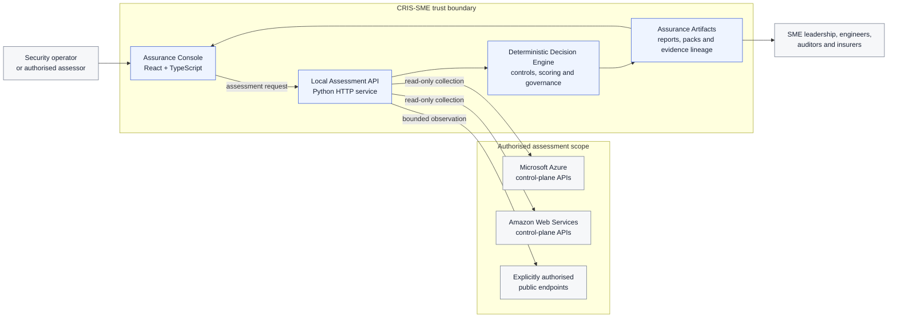
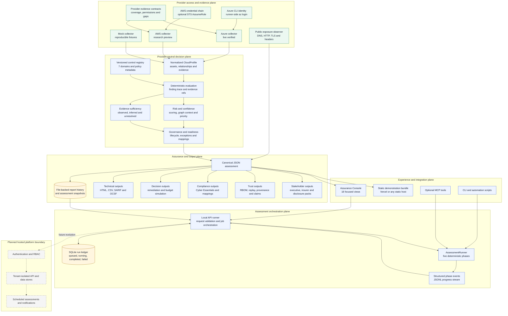
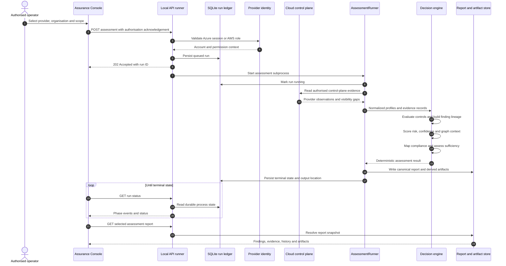

# CRIS-SME Architecture

This document is the architectural source of truth for CRIS-SME. It describes
the implementation that exists today, the trust boundaries around live cloud
collection, and the deliberate boundary between the local/self-hosted product
and the planned hosted multi-tenant platform.

## System Context

CRIS-SME is an evidence-to-decision system. Cloud APIs provide read-only posture
evidence; deterministic controls turn that evidence into explainable findings;
and one canonical assessment model feeds technical, executive, compliance, and
assurance outputs.

## Component Architecture

The major components are separated so provider authentication, collection,
decision logic, persistence, and presentation can evolve independently. Solid
arrows below are implemented paths. The final dashed boundary is the planned
hosted-service evolution, not a claim about the current product.

## Assessment Flow

Each live run keeps cloud credentials outside the browser. The API starts a
background process, records process state in SQLite, emits structured progress,
and publishes the completed report snapshot and derived artifacts.

## Core Data Contracts

| Contract | Purpose | Authoritative implementation |
| --- | --- | --- |
| `CloudProfile` | Provider-normalized posture consumed by every control domain | `models/cloud_profile.py` |
| `Asset`, `AssetRelationship` | Resource inventory and graph context | `models/platform.py` |
| `EvidenceRecord`, `CollectorCoverage` | Evidence provenance and observability boundaries | `models/platform.py` |
| `Finding`, `FindingTrace` | Stable control decision, evidence lineage and rationale | `models/finding.py`, `models/platform.py` |
| `ScoringResult` | Deterministic priority and aggregate risk outputs | `engine/scoring.py` |
| `AssessmentRunnerResult` | Provider-neutral result before artifact generation | `engine/assessment_runner.py` |
| Canonical JSON report | Shared payload for every console and export view | `reporting/json_report.py` |
| Assessment run record | Durable orchestration status; never stores AWS External IDs | `api/run_repository.py` |

The console is intentionally non-authoritative: it displays these contracts but
does not calculate findings, modify scores, or infer unavailable evidence.

## Security and Trust Boundaries

1. **Authorisation boundary.** A live assessment requires explicit operator
   acknowledgement and must target an estate the operator is authorised to test.
2. **Credential boundary.** Azure uses the runner's existing Azure CLI session.
   AWS uses the standard SDK credential chain and can assume a customer role with
   short-lived STS credentials. Provider credentials are not sent to the React UI.
3. **Collection boundary.** Collectors make read-only control-plane calls. Public
   exposure mode is limited to DNS, HTTP, HTTPS, TLS, redirect, and header
   observation; it does not exploit, crawl, or brute force targets.
4. **Decision boundary.** Controls and scores are deterministic and versioned.
   Optional narrative features cannot create findings or alter risk values.
5. **Evidence boundary.** Missing, partial, stale, or inferred evidence remains
   visible through coverage, confidence, and evidence-sufficiency metadata.
6. **Persistence boundary.** Run process state is durable in SQLite. Full reports
   and artifacts are currently file-backed. Multi-tenant isolation is not yet
   implemented, so the local API must not be exposed directly to the internet.
7. **Integrity boundary.** Replay, RBOM, hashes, decision provenance, and
   claim-verification artifacts make the path from evidence to stakeholder claim
   inspectable.

## Deployment Modes

| Mode | UI | Assessment execution | Persistence | Intended use |
| --- | --- | --- | --- | --- |
| Static demo | Prebuilt React bundle | None; reads bundled assessment data | Static files | Product demonstration and report exploration |
| Local development | Vite dev server | Local Python API and provider CLI/SDK identity | SQLite runs plus file-backed reports | Engineering and authorised testing |
| Self-hosted trial | Container-built console and local API | Customer-controlled runtime | Mounted SQLite/report volumes | Private pilot in a controlled network |
| Hosted multi-tenant service | Planned | Planned isolated workers | Planned tenant database and object storage | Future MSP/SaaS operation |

## Architectural Invariants

- The same normalized evidence and deterministic engine feed every audience view.
- Provider-specific behavior ends at the normalization boundary.
- A generated narrative cannot become evidence and cannot change a score.
- Every risk decision should retain a control ID, evidence reference, rule version,
  confidence rationale, and lifecycle identity.
- Unsupported visibility is represented as a gap, not silently treated as a pass.
- Static publication contains generated artifacts, never live provider credentials.

## Current Maturity and Next Boundary

Azure collection is live-verified. AWS collection and cross-account role
assumption are implemented and have been exercised in an authorised live
assessment, while AWS provider semantics remain labelled `research_preview`
until broader provider-specific validation is complete. Mock mode remains the
reproducible development and CI path.

The next architectural milestone is pilot readiness: API authentication,
per-assessment artifact isolation, database-backed report metadata, and Azure
browser-based delegated onboarding. Tenant isolation, RBAC, scheduling, and
hosted worker orchestration belong to the later multi-tenant platform boundary.

Related detail:

- [Frontend console](frontend-console.md)
- [Data model](data-model.md)
- [Provider evidence contracts](provider-evidence-contracts.md)
- [Security and trust model](security-trust-model.md)
- [SaaS and API evolution](saas-api-evolution.md)
- [2026 H2 roadmap](roadmap-2026-h2.md)
