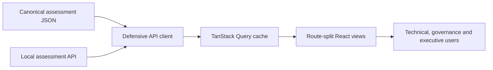

# Frontend Architecture

The current CRIS-SME frontend is the React Assurance Console in
`frontend/console/`. It is a presentation and workflow layer over canonical
assessment reports; it does not calculate findings, scores, priorities, or
confidence.

## Runtime Modes

### API-backed local or self-hosted mode

- React + TypeScript + Vite application
- local Python API runner at `http://127.0.0.1:8787`
- live Azure, AWS, and public-exposure assessment workflows
- run progress, persisted process history, report selection, and artifact access
- provider credentials remain in the API runner environment, outside the browser

### Static demonstration mode

- prebuilt React assets under `dist/site/console/`
- generated assessment reports bundled as static data
- no live collector or API service
- suitable for Vercel and other static hosts

The legacy generated HTML dashboard remains an export artifact, not the primary
interactive application.

## Data Direction

Missing report fields render as unavailable or not observed. They are never
inferred in the UI. See [Frontend Console](frontend-console.md) for routes, build
commands, and endpoint contracts, and [CRIS-SME Architecture](architecture.md)
for the complete system and trust-boundary view.
